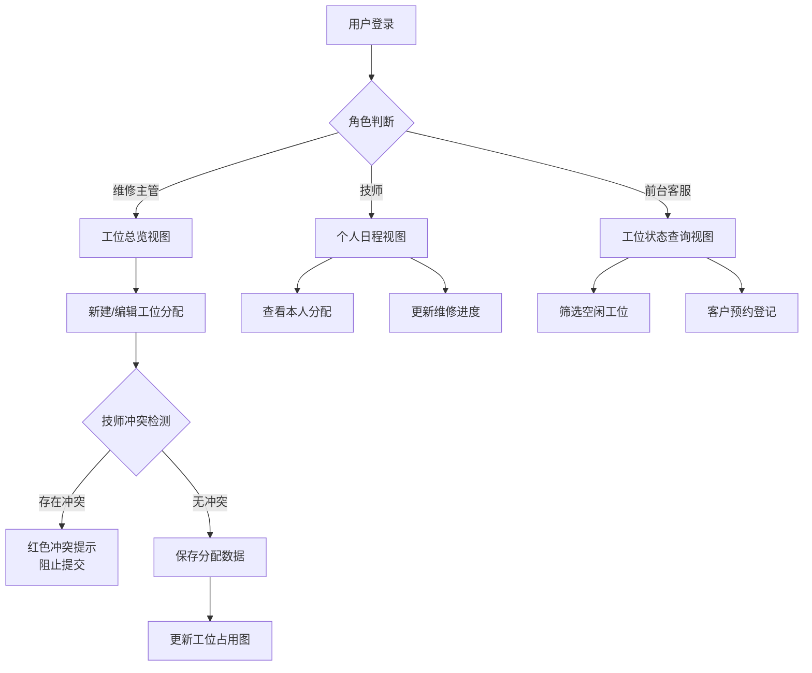

## 1. 产品概述

维修工位占用图是一款面向汽车维修服务门店的可视化工位管理系统，通过直观的时间轴视图展示各维修工位的占用状态，支持多角色差异化视角，实现技师工位分配冲突的实时检测与预警。

- **核心价值**：解决维修车间工位调度混乱、技师工时冲突问题，提升工位利用率和运营效率
- **目标用户**：维修主管、技师、前台客服三大核心角色

---

## 2. 核心功能

### 2.1 用户角色

| 角色 | 登录方式 | 核心权限 |
|------|----------|----------|
| 维修主管 | 账号密码 | 全览所有工位状态、分配/调整工位、导出报表、查看统计数据 |
| 技师 | 账号密码 | 查看本人工位分配、更新维修进度、查看当日工作安排 |
| 前台客服 | 账号密码 | 查看工位占用状态、预约登记、基础信息查询 |

### 2.2 功能模块

1. **登录页面**：角色选择、账号登录、权限验证
2. **工位占用图主页面**：时间轴视图、工位卡片、车辆/设备信息展示
3. **工位分配弹窗**：新建/编辑工位分配、技师选择、时间设置
4. **筛选排序面板**：按工位、技师、状态、时间范围筛选
5. **导出打印模块**：导出Excel/CSV、打印工位安排表
6. **冲突检测提示**：实时检测技师工位冲突并给出警告

### 2.3 页面详情

| 页面名称 | 模块名称 | 功能描述 |
|---------|---------|----------|
| 登录页面 | 角色选择 | 三个角色卡片切换、账号密码输入、登录验证 |
| 工位占用图 | 时间轴头部 | 日期切换、时间段展示、今日快速定位 |
| 工位占用图 | 工位列表 | 工位编号、工位名称、当前状态、占用条拖拽 |
| 工位占用图 | 分配卡片 | 车辆信息、技师姓名、预计时长、进度状态 |
| 工位占用图 | 筛选工具栏 | 工位筛选、技师筛选、状态筛选、时间范围选择 |
| 工位占用图 | 操作栏 | 新建分配、导出、打印、视图切换 |
| 分配弹窗 | 表单模块 | 车辆信息、技师选择、开始/结束时间、备注 |
| 分配弹窗 | 冲突提示 | 技师时间冲突红色警告、建议调整时间 |

---

## 3. 核心流程

### 3.1 主要用户流程

**维修主管工位分配流程**：
1. 主管登录系统 → 进入工位总览页面
2. 点击"新建分配"或拖拽时间轴 → 打开分配表单
3. 选择工位、技师、车辆信息，设置时间范围
4. 系统实时检测冲突 → 若同一技师在同一时间段已有分配，弹出冲突警告
5. 确认无冲突后提交 → 工位占用图更新显示

**技师查看日程流程**：
1. 技师登录 → 系统自动筛选展示本人的工位分配
2. 查看当日/本周工作安排、车辆信息、预计完成时间
3. 更新维修进度状态（待开始/进行中/已完成）

**前台客服查询流程**：
1. 客服登录 → 查看所有工位实时状态
2. 筛选空闲工位 → 为客户预约维修时间
3. 查看预计完工时间 → 告知客户取车时间

### 3.2 核心流程图

---

## 4. 用户界面设计

### 4.1 设计风格

- **主色调**：工业蓝 (#165DFF) 作为主色，搭配深灰 (#1D2129) 背景，营造专业、高效的工业感
- **辅助色**：状态色 - 空闲 (#00B42A)、占用中 (#FF7D00)、冲突 (#F53F3F)、已完成 (#86909C)
- **字体**：标题使用 Roboto，正文使用 Inter，数字使用 monospace 字体增强可读性
- **布局风格**：卡片式布局 + 时间轴甘特图风格，清晰的网格线和时间刻度
- **图标风格**：使用 Lucide 线性图标，保持简洁统一

### 4.2 页面设计概述

| 页面名称 | 模块名称 | UI 元素 |
|---------|---------|---------|
| 登录页面 | 角色选择 | 三张角色卡片带图标、悬停动效、选中高亮 |
| 工位占用图 | 时间轴头部 | 固定顶部、日期左右箭头切换、时间刻度每小时一格 |
| 工位占用图 | 工位行 | 左侧工位信息固定、右侧可横向滚动时间轴、占用块彩色标识 |
| 工位占用图 | 冲突标识 | 红色边框闪烁、感叹号图标、悬停显示冲突详情 |
| 分配弹窗 | 表单 | 分组字段、技师下拉搜索、时间选择器、实时验证提示 |
| 筛选工具栏 | 筛选器 | 多条件联级筛选、标签式展示筛选条件、一键清除 |

### 4.3 响应式设计

- **桌面端优先**：时间轴视图需要较大横向空间，优化 1280px+ 宽屏体验
- **平板适配**：压缩时间刻度密度，简化信息展示
- **触控优化**：工位分配块增大点击区域，弹窗按钮适配触控操作

### 4.4 动效设计

- 页面加载：卡片依次淡入上移，时间轴从左到右逐步绘制
- 冲突检测：冲突块红色边框脉冲动画，警告图标抖动
- 状态变更：颜色渐变过渡，进度条平滑增长
- 拖拽分配：幽灵半透明效果，放置时弹性缓动
