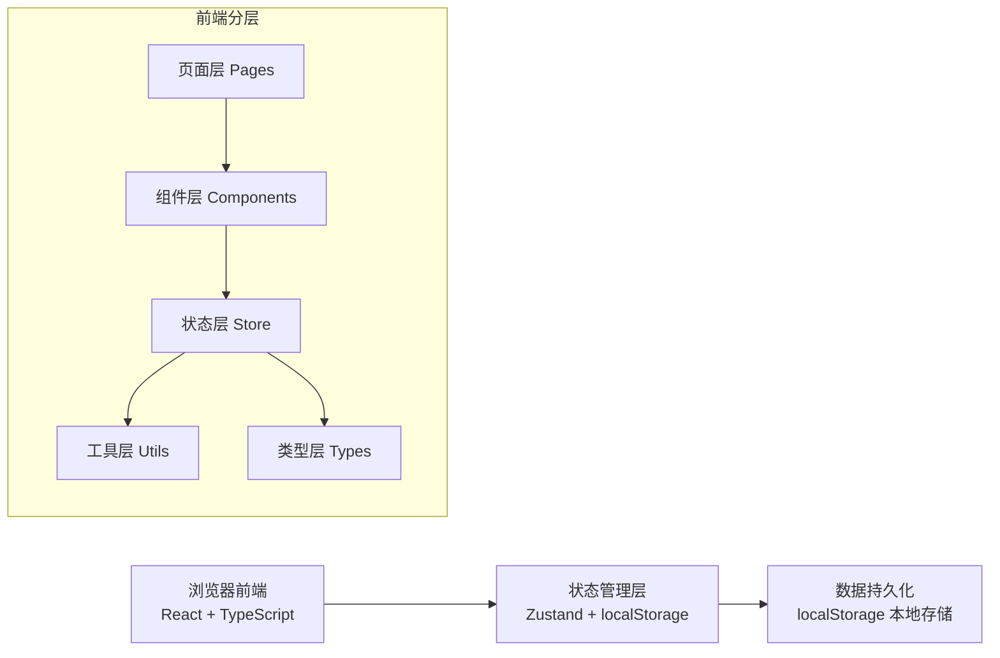

## 1. 架构设计



---

## 2. 技术选型

| 层级 | 技术栈 | 版本 | 说明 |
|------|--------|------|------|
| 前端框架 | React | 18.x | 组件化开发 |
| 开发语言 | TypeScript | 5.x | 类型安全 |
| 构建工具 | Vite | 5.x | 快速构建 |
| 样式方案 | TailwindCSS | 3.x | 原子化CSS |
| 状态管理 | Zustand | 4.x | 轻量状态管理 + localStorage 持久化 |
| 路由管理 | React Router DOM | 6.x | 单页路由 |
| 图标库 | Lucide React | latest | 线性图标 |
| 导出功能 | 原生 JS + CSV | - | 不依赖第三方导出库 |
| 打印功能 | window.print() | - | 浏览器原生打印 |

### 2.1 初始化方式

使用 `react-ts` 模板（纯前端，无后端）：
```
npm init vite-init@latest -y . -- --template react-ts --force
```

---

## 3. 路由定义

| 路由路径 | 页面名称 | 权限角色 | 说明 |
|---------|---------|---------|------|
| `/login` | 登录页面 | 所有 | 角色选择 + 账号登录 |
| `/dashboard` | 工位占用图主页 | 维修主管/技师/客服 | 主页面，根据角色展示不同视图 |
| `*` | 404重定向 | - | 重定向到登录页 |

---

## 4. 数据模型

### 4.1 核心数据类型

```typescript
// 用户角色
type UserRole = 'supervisor' | 'technician' | 'reception';

// 用户信息
interface User {
  id: string;
  username: string;
  password: string;
  role: UserRole;
  name: string;
  avatar?: string;
}

// 工位信息
interface Workstation {
  id: string;
  code: string;      // 工位编号 W01, W02...
  name: string;      // 工位名称 如：机修工位1
  type: string;      // 类型：机修/钣金/喷漆
}

// 车辆/设备信息
interface Vehicle {
  id: string;
  plateNumber: string;   // 车牌号
  brand: string;         // 品牌
  model: string;         // 车型
  owner: string;         // 车主姓名
  phone: string;         // 联系电话
}

// 维修状态
type AssignmentStatus = 'pending' | 'in_progress' | 'completed';

// 工位分配记录
interface Assignment {
  id: string;
  workstationId: string;
  technicianId: string;
  vehicleId: string;
  startTime: string;     // ISO 时间字符串
  endTime: string;       // ISO 时间字符串
  status: AssignmentStatus;
  description: string;   // 维修项目描述
  createdAt: string;
  updatedAt: string;
}

// 冲突检测结果
interface ConflictResult {
  hasConflict: boolean;
  conflictType?: 'technician' | 'workstation';
  message?: string;
  conflictingAssignment?: Assignment;
}
```

### 4.2 数据持久化

使用 localStorage 存储键值：
- `workstation_users`: 用户账号列表
- `workstation_workstations`: 工位列表
- `workstation_vehicles`: 车辆信息列表
- `workstation_assignments`: 工位分配记录
- `workstation_current_user`: 当前登录用户

---

## 5. 状态管理设计

### 5.1 Zustand Store 划分

```typescript
// useAuthStore - 认证状态
interface AuthState {
  currentUser: User | null;
  login: (username: string, password: string) => boolean;
  logout: () => void;
  isAuthenticated: () => boolean;
}

// useWorkstationStore - 工位与分配数据
interface WorkstationState {
  workstations: Workstation[];
  vehicles: Vehicle[];
  technicians: User[];
  assignments: Assignment[];
  
  // CRUD 操作
  addAssignment: (data: Omit<Assignment, 'id' | 'createdAt' | 'updatedAt'>) => void;
  updateAssignment: (id: string, data: Partial<Assignment>) => void;
  deleteAssignment: (id: string) => void;
  
  // 业务操作
  checkConflict: (technicianId: string, startTime: string, endTime: string, excludeId?: string) => ConflictResult;
  getAssignmentsByDate: (date: string) => Assignment[];
  getAssignmentsByTechnician: (techId: string) => Assignment[];
}

// useUIFilterStore - 筛选排序状态
interface UIFilterState {
  selectedDate: string;
  selectedWorkstations: string[];
  selectedTechnicians: string[];
  statusFilter: AssignmentStatus[];
  sortBy: 'time' | 'workstation' | 'technician';
  sortOrder: 'asc' | 'desc';
  
  setFilter: (key: keyof UIFilterState, value: any) => void;
  resetFilters: () => void;
  getFilteredAssignments: () => Assignment[];
}
```

---

## 6. 核心算法 - 冲突检测

### 6.1 技师时间重叠检测

```typescript
function checkTechnicianConflict(
  technicianId: string,
  startTime: string,
  endTime: string,
  excludeId?: string
): ConflictResult {
  const start = new Date(startTime).getTime();
  const end = new Date(endTime).getTime();
  
  // 查找该技师的所有分配
  const techAssignments = assignments.filter(a => 
    a.technicianId === technicianId && a.id !== excludeId
  );
  
  for (const assignment of techAssignments) {
    const aStart = new Date(assignment.startTime).getTime();
    const aEnd = new Date(assignment.endTime).getTime();
    
    // 时间区间重叠判断：[start, end) 与 [aStart, aEnd)
    const hasOverlap = start < aEnd && end > aStart;
    
    if (hasOverlap) {
      return {
        hasConflict: true,
        conflictType: 'technician',
        message: `该技师在 ${formatTimeRange(aStart, aEnd)} 已有分配`,
        conflictingAssignment: assignment
      };
    }
  }
  
  return { hasConflict: false };
}
```

### 6.2 工位占用重叠检测

同上述算法，将 `technicianId` 替换为 `workstationId` 即可。

---

## 7. 目录结构

```
src/
├── components/           # 通用组件
│   ├── layout/           # 布局组件
│   │   ├── Header.tsx
│   │   └── Sidebar.tsx
│   ├── workstation/      # 工位相关组件
│   │   ├── WorkstationTimeline.tsx
│   │   ├── AssignmentCard.tsx
│   │   ├── AssignmentModal.tsx
│   │   └── ConflictAlert.tsx
│   ├── common/           # 通用UI
│   │   ├── Button.tsx
│   │   ├── Modal.tsx
│   │   ├── DatePicker.tsx
│   │   └── Select.tsx
│   └── filters/          # 筛选组件
│       ├── FilterBar.tsx
│       └── FilterTag.tsx
├── pages/                # 页面
│   ├── Login.tsx
│   └── Dashboard.tsx
├── store/                # Zustand 状态
│   ├── useAuthStore.ts
│   ├── useWorkstationStore.ts
│   └── useFilterStore.ts
├── types/                # TypeScript 类型
│   └── index.ts
├── utils/                # 工具函数
│   ├── dateUtils.ts
│   ├── exportUtils.ts
│   ├── conflictUtils.ts
│   └── storage.ts
├── data/                 # 样例数据
│   └── mockData.ts
├── hooks/                # 自定义 Hooks
│   ├── useRoleAccess.ts
│   └── useConflictDetection.ts
├── App.tsx
├── main.tsx
└── index.css
```

---

## 8. 角色权限控制

通过自定义 Hook `useRoleAccess` 实现：

```typescript
function useRoleAccess() {
  const { currentUser } = useAuthStore();
  
  return {
    canEditAssignment: () => currentUser?.role === 'supervisor',
    canViewAllTechnicians: () => currentUser?.role !== 'technician',
    canExport: () => currentUser?.role === 'supervisor' || currentUser?.role === 'reception',
    canUpdateStatus: () => currentUser?.role === 'technician' || currentUser?.role === 'supervisor',
  };
}
```

---

## 9. 导出与打印实现

### 9.1 CSV 导出

```typescript
function exportToCSV(assignments: Assignment[]) {
  const headers = ['工位', '技师', '车牌号', '开始时间', '结束时间', '状态', '维修项目'];
  const rows = assignments.map(/* 数据映射 */);
  const csvContent = [headers, ...rows].map(row => row.join(',')).join('\n');
  
  const blob = new Blob(['\ufeff' + csvContent], { type: 'text/csv;charset=utf-8;' });
  const link = document.createElement('a');
  link.href = URL.createObjectURL(blob);
  link.download = `工位安排_${formatDate(new Date())}.csv`;
  link.click();
}
```

### 9.2 打印功能

使用 `@media print` CSS 媒体查询 + `window.print()` 实现打印友好视图。

---

## 10. 自动化测试方案

### 10.1 测试脚本位置

```
tests/
└── conflict-check.test.js   # 冲突检测自动化测试
```

### 10.2 测试用例核心逻辑

```javascript
// 测试场景：给同一技师分配两个重叠时间段的工位
async function testTechnicianConflict() {
  // 1. 登录维修主管账号
  await login('supervisor', '123456');
  
  // 2. 创建第一个分配：技师A 09:00-11:00
  const assignment1 = await createAssignment({
    technicianId: 'tech_001',
    startTime: '2024-01-15T09:00:00',
    endTime: '2024-01-15T11:00:00',
  });
  assert(assignment1.success === true);
  
  // 3. 尝试创建第二个分配：技师A 10:00-12:00（重叠）
  const assignment2 = await createAssignment({
    technicianId: 'tech_001',
    startTime: '2024-01-15T10:00:00',
    endTime: '2024-01-15T12:00:00',
  });
  
  // 4. 验证冲突提示出现
  assert(assignment2.success === false);
  assert(assignment2.conflictDetected === true);
  assert(assignment2.message.includes('已有分配'));
  
  console.log('✅ 技师工位冲突检测测试通过');
}
```
